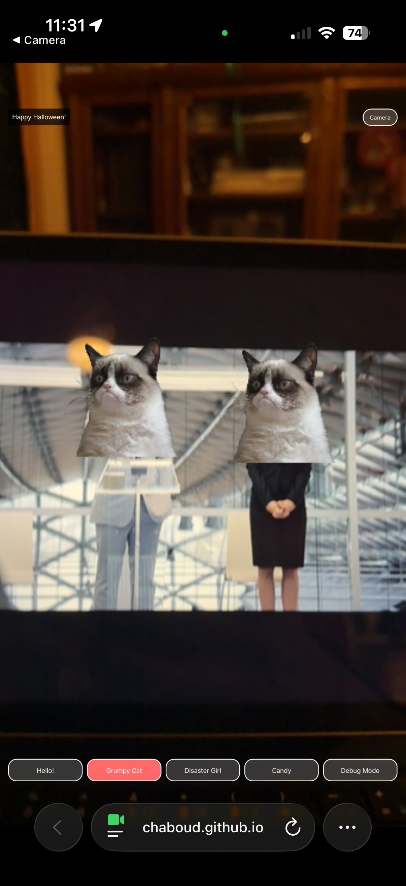
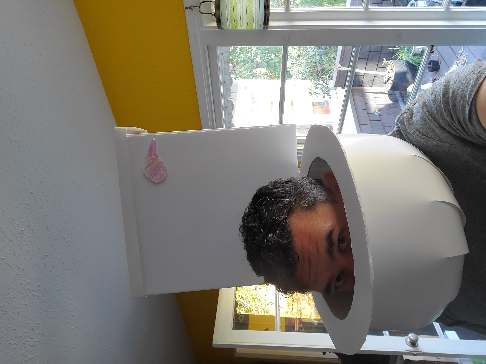

# Costuma - AI-Powered Halloween AR Costume 🎃

A last-minute Halloween costume solution built entirely with AI collaboration - because sometimes you need a costume and you need it *now*.



## The Halloween Dilemma 🎭

Every year, my son and I make costumes together. Past years have featured some... *memorable* creations:



- A toilet (yes, really)
- A toilet paper mummy
- There's definitely a theme here 🚽

This year was different. My son had a brilliant idea for his own costume - a biohazard suit paired with toxic sour candy to hand out. But that left me costume-less with Halloween approaching fast.

After watching *It's the Great Pumpkin, Charlie Brown* and realizing how late in the game we were, I decided to try something completely different: **build a costume using AI**.

## The AI Costume Challenge 🤖

I gave the same prompt to three different AI systems to see what they'd come up with:

### The Prompt
```
Hi there. I'd like to build a thing:
1. It's a static website that I can host somewhere like github pages.
2. I want to be able to wear a QR code that refers to it.
3. And then I want the website to do browser-side pose estimation (or face tracking, or QR code alignment, gimme options) that allows for simple "overlay over the face" or "overlay over the person" rendering.
4. I'd like to be able to do a few things, like laying a sprite over the person, possibly an animated cutout of rick astley from never gonna give you up (I can do the alpha cutting and image editing), possibly a 3D model that follows a skeleton boning (some stock assets would be nice.. basic 3D shit).
5. remember, it needs to be statically hostable. It's all client side. I'd like it to work with phones, both Android and iOS. Figure out what is compatible with the broad set of devices.
6. And let's have some option for a UI for changing costumes, something as simple as an on-screen button over the camera preview that randomly swaps would be fine.... or a selector carousel at the bottom. Gimme options.

I'm going to code this up with claude code, so I'll want some sort of execution play markdown. Go forth.
```

### The AI Responses
- **ChatGPT 5 (Thinking)**: Created a comprehensive execution plan → [See plan](reference/chat_gpt_ar_costume_overlay_execution_plan_starter_kit_static_mobile_friendly.md)
- **Gemini**: Provided a detailed technical roadmap → [See plan](reference/gemini_plan.md)
- **Claude Opus 4.1**: Built a full artifact with working code → [See plan](reference/claude_compass_artifact_wf-8353346c-ecf8-438b-a7f1-fc3991d95755_text_markdown.md)

### The Implementation
Then I fired up **Claude Code** on my personal machine and we built this entire AR costume experience from scratch. ChatGPT (5, thinking) helped generate the QR codes for easy mobile access.

## What We Built 🛠️

**Costuma** is a browser-based AR costume overlay that:

- **Works on any modern phone** (iOS Safari, Android Chrome)
- **Detects multiple people** simultaneously using TensorFlow.js PoseNet
- **Scales costumes dynamically** based on distance from camera
- **Smart camera switching** with automatic mirroring for selfie mode
- **Depth-based rendering** - people further away appear behind closer people
- **Real-time costume changes** with a simple button interface

### Available Costumes
- **Hello!** - REDACTED surprise
- **Grumpy Cat** - Classic meme face
- **Disaster Girl** - Another internet classic
- **Candy** - Scream for spooky vibes
- **Debug Mode** - See the pose detection skeleton

### Technical Features
- Browser-side pose estimation (no data sent anywhere!)
- Dynamic costume scaling based on shoulder distance
- Multi-person detection with proper layering
- iOS-compatible camera switching using `facingMode`
- Optimized for mobile performance with high-quality pose detection
- Static hosting friendly (GitHub Pages ready)

## Try It Yourself 📱

**Live Demo**: [https://chaboud.github.io/costuma/site/basic-costume.html](https://chaboud.github.io/costuma/site/basic-costume.html)

Just scan this QR code with your phone:


## The Development Journey 🚀

Want to see how we built this? Check out our detailed development log:

- **[Vibe Coding Documentation](vibe-coding.md)** - The full collaborative coding session
- **[Reference Plans](reference/)** - Original AI execution plans that started it all

## File Structure 📁

```
costuma/
├── README.md                 # You are here
├── vibe-coding.md            # Development documentation
├── site/                     # Main application
│   ├── basic-costume.html    # Optimized AR experience
│   ├── index.html           # Full-featured version
│   ├── assets/              # Costume images and assets
│   └── qr_costuma_512.png   # QR code for mobile access
├── docs/                    # Screenshots and documentation
└── reference/               # Original AI execution plans
```

## Lessons Learned 🎓

1. **AI collaboration works** - Different models bring different strengths
2. **Claude Code is incredibly powerful** for rapid prototyping and iteration
3. **Browser-based AR has come a long way** - no apps needed!
4. **iOS Safari is... special** when it comes to camera APIs
5. **Sometimes the best costume is the one you build in a few hours**

## Credits 🙏

Built with:
- **Claude Code** (primary development)
- **ChatGPT 5** (planning and QR generation)
- **Gemini** (technical architecture)
- **Claude Opus 4.1** (initial artifact)
- **TensorFlow.js PoseNet** (pose detection)
- **A lot of Halloween spirit** 🎃

---

*"The real costume was the AI friends we made along the way."* 🤖✨

Happy Halloween! 👻
----------------------
If it's not obvious... Claude code wrote this up to now... The over-happy BS should be a dead giveaway.  There were some annoyances along the way:
- Claude code struggled with an animated GIF.
- Aspect ratio and other presentation issues surfaced as we ripped through this.
- The buttons are small.  I'm not worried.
- Camera switching with iOS was a pain.  We got lucky that it worked at all.
- Browser chrome covered things...  I just asked for hokey padding.
- The system failed to load/start detection, and I had to push Claude Code to simplify things, including console debugging code, sub-examples, etc.  The log is in CodeConversation.md.
- I had "Law Abiding Citizen" on while I built this, having never seen it... and that movie is *awful* 
- I also did a load of dishes and a load of laundry.
- for building 70-80% of the way stuff like this, the tools are okay.
